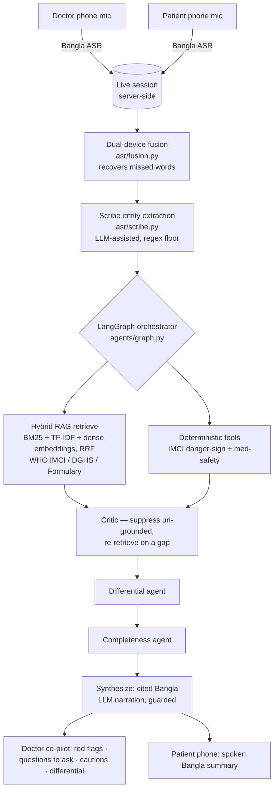

# Codoctor (কো-ডক্টর)
### An ambient Bangla clinical co-pilot + deterministic safety-net + patient-held record for Bangladesh's overloaded OPDs

> A second pair of ears in the consultation room. A patient scans a QR to join the doctor's live session; both phones listen in Bangla; the two transcripts are fused into one; a team of agents — grounded in official clinical guidelines, **with citations** — makes sure no danger sign or drug interaction is missed. The high-stakes calls are made by **deterministic rule engines, never the LLM**. The patient walks out with a plain-Bangla spoken summary they keep.

**Built for the SciBlitz AI Challenge 2026 — IEEE Student Branch, CUET · Track A (Health & Society).**

🔗 **Live (no login):** https://codoctor.vercel.app — open `/room` in **Chrome/Edge** and click **Run demo consultation**.
🔗 **API:** https://codoctor-api-afdkbhe8d4bpffb5.centralindia-01.azurewebsites.net/docs

---

## The problem

In Bangladesh's government-hospital OPDs, one doctor often sees 80–150+ patients a day — a real consultation is **60–120 seconds**. In that window things get missed (an un-asked red-flag question, an unchecked drug interaction, an un-escalated danger sign); nothing is recorded (there is **no national EHR** — the record is a paper slip the patient loses); and the Bangla-only, low-literacy patient can't read the English prescription they're handed.

## The core idea: AI understands, deterministic engines decide

AI owns everything *ambiguous* — hearing noisy bilingual speech, extracting clinical meaning from free-form Bangla, finding the right guideline across languages, explaining in plain words. The one **irreversible** call is owned by deterministic, auditable rule engines, each returning its own citation:

- **`safety/imci.py`** — the WHO IMCI "cough or difficult breathing" decision tree (age-specific fast-breathing thresholds: ≥50/min at 2–11 months, ≥40/min at 12–59 months; plus chest indrawing, stridor, and general danger signs).
- **`safety/medsafety.py`** — allergy, class cross-sensitivity, drug–drug interaction, and duplication checks against exact-match tables.

This is the cleanest answer to the obvious objection — *"what if the AI is wrong?"* — the dangerous decisions are not the AI's to make.

### The AI layer (key-optional, three roles)

With `OPENAI_API_KEY` set (see `backend/.env.example`), three AI upgrades activate; without it, each falls back to a free deterministic path so the public demo can never break:

| Role | With key (OpenAI) | Keyless fallback |
|---|---|---|
| **Scribe** (`asr/scribe.py`) | **GPT-4o-mini structured extraction** reads paraphrased/colloquial Bangla the lexicon can't; merged *on top of* the regex pass, which is a safety floor it can add to but never remove from | Lexicon + regex extraction |
| **Retrieval** (`rag/retriever.py` + `rag/embeddings.py`) | **text-embedding-3-small dense ranker** fused into the RRF, so a Bangla query finds the English guideline that *means* the same thing | BM25 + TF-IDF |
| **Narration** (`agents/graph.py`) | GPT-4o-mini rewrites grounded findings as warm, natural caregiver Bangla — behind a guard that rejects any output introducing a drug the engines never surfaced | Deterministic Bangla template |

The LLM **never makes a clinical decision** in any of the three roles.

## What it does, end to end

1. **QR-joined live session** — the doctor opens `/room` and gets a QR + session code; the patient scans it to join on their phone.
2. **Dual-device capture + fusion** — both phones stream browser-recognized Bangla speech into one session; `asr/fusion.py` reconciles the two transcripts and **recovers words one mic missed from the other** (only merging genuine same-utterance overlaps).
3. **Structure + reason** — `asr/scribe.py` extracts clinical entities (LLM-assisted, regex-grounded); a **LangGraph** orchestrator retrieves cited guidance, runs the deterministic safety tools, self-critiques (re-retrieving on a grounding gap), then runs differential + completeness agents and synthesizes.
4. **Two outputs** —
   - **Doctor co-pilot panel**: a prioritized "second pair of ears" — 🔴 **red flags** the doctor must not miss right now (an IMCI danger-sign escalation, *"Do not prescribe Amoxicillin — patient is allergic to penicillin"*), ❓ **guideline questions not yet asked** in this consult, 💊 medication cautions, and 🔎 a differential to consider — every item cited.
   - **Patient's phone**: shows and **speaks** a plain-Bangla "what you have / do / watch for" summary.

**Advisory & non-diagnostic. The clinician is always the decision-maker.**

## Why two phones? (and what happens without a patient phone)

**The problem with one microphone.** A government OPD is loud — other patients, fans, corridor noise. A single phone sitting on the desk mishears words, and Bangla speech recognition drops exactly the words that matter (a mumbled *"বুকটা টেনে টেনে"* — chest indrawing — or *"দ্রুত"* — fast). Miss one danger-sign word and the whole assessment is wrong.

**What two phones buy us.** The doctor's phone and the patient's phone hear the *same* conversation from two positions. When one mic drops a word, the other usually caught it. `asr/fusion.py` lines up the two transcripts by time + overlap and **recovers the missed words from whichever phone heard them** — so the pipeline reasons over one clean transcript instead of two lossy ones. It costs nothing extra: it uses the phones people already have, not a special microphone array. Giving the patient a phone in the session is also what lets the final summary be **pushed to them and spoken aloud in Bangla** on their own device — the record literally stays with them.

**How the patient joins.** The doctor opens `/room`, which shows a QR code + a short session code. The patient scans the QR (or types the code in Patient mode) to join — no app install, no login.

**If the patient has no phone — solo mode.** Many patients don't own a smartphone, so `/room` has a **Has phone / No phone** toggle. In *solo mode* the doctor's single phone becomes the one source of truth: it records the whole conversation and runs the exact same pipeline (safety checks, RAG, summary). Nothing is lost except the second-mic word-recovery. Afterwards the record is shared the low-tech way — the doctor reads the plain-Bangla summary aloud, and it can be saved/printed as a PDF for the patient to take home.

**If you have no second phone at all — seeded demo.** For a solo tester or a judge, the **`Run demo consultation`** button on `/room` replays a canonical two-device transcript through the *real* pipeline, so you still see the fusion recover the danger-sign words and the full safety flow fire — no second device or live mic required.

## Architecture



## Results (reproducible)

Software-correctness on our authored eval set — **not** patient-outcome accuracy. Run it yourself:

```bash
cd backend && python eval/run_eval.py
```

| Metric | Result |
|---|---|
| IMCI classification accuracy (N=17) | **17/17 (100%)** |
| Danger-sign recall — missed referrals | **5/5 — 0 missed** |
| Specificity — false referrals | **12/12 — 0 false** |
| Medication-safety catch rate (N=13) | **7/7 (100%)** |
| Medication false-positives | **0/6 (0%)** |
| Orchestrator grounding / citation | **3/3 (100%)** |
| Honest refusal on insufficient data | **1/1 (100%)** |

Unit tests: **47/47** (`safety` 9 · `rag` 6 · `asr` 4 · `agents` 6 · `sessions` 4 · `features` 18) — `python backend/tests/test_*.py`. All numbers are measured on the keyless deterministic path, so they hold for any judge's cold visit.

## Routes

| Route | What it is |
|---|---|
| `/` | Landing — problem, how it works, the agents, safety stance |
| `/room` | **Real live consultation** — create a session, show the QR, both phones listen, fuse → analyze → push to patient. **`Run demo consultation`** replays the canonical case through the full pipeline with no second phone. |
| `/patient?s=<id>` | **Real patient phone** — joins a session, listens, then shows + speaks the actual Bangla summary. `/patient` with no id is the scripted demo. |
| `/doctor` | Scripted demo cockpit (iOS-safe; no mic needed) — live transcript → agent trace → the two deterministic catches → SOAP note |
| `/live` | Voice quick-check — speak/type a child's symptoms, get a grounded cited assessment from the live backend |

## Tech stack (as built)

| Layer | Choice |
|---|---|
| Frontend | Next.js 14 + Tailwind on Vercel |
| Backend | Python FastAPI on Azure App Service (Always On — no cold start) |
| Agents | LangGraph orchestrator (intake → retrieve → tools → critic → differential → completeness → synthesize) + doctor co-pilot aggregation |
| Scribe | **GPT-4o-mini structured extraction** (key-optional) merged over a lexicon/regex floor |
| Retrieval | Hybrid **BM25 + TF-IDF + OpenAI dense embeddings (key-optional), RRF-fused** over a curated, cited WHO IMCI / DGHS STG / National Formulary corpus |
| ASR / TTS | **OpenAI Whisper** (`whisper-1`) for uploaded mobile audio + keyless **Browser Web Speech API** (`bn-BD`) in-browser; with a typed/seeded fallback |
| LLM | OpenAI **GPT-4o-mini** (key-optional) for extraction + Bangla **narration only** — never the high-stakes decision; deterministic fallbacks throughout |
| Safety core | Deterministic WHO IMCI danger-sign tree + drug allergy/interaction/duplication engine |
| Live sync | Short HTTP polling (~3s) between the two devices' views |

## Run it locally

**Backend** (Python 3.11+):
```bash
cd backend
python -m venv .venv && source .venv/Scripts/activate   # Windows; use bin/activate on macOS/Linux
pip install -r requirements.txt
cp .env.example .env                                     # optional: paste OPENAI_API_KEY to enable the AI layer
uvicorn app.main:app --reload --port 8000               # docs at http://localhost:8000/docs
```

**Frontend** (Node 18+):
```bash
cd frontend
npm install
echo "NEXT_PUBLIC_API_URL=http://localhost:8000" > .env.local
npm run dev                                              # http://localhost:3000
```

Open `http://localhost:3000/room` in Chrome → **Run demo consultation**, or scan the QR with a phone to join a live two-device session.

> Notes: mic + Bangla speech recognition need **Chrome/Edge** (not iOS Safari). The hosted backend runs on **Azure App Service with Always On**, so it stays warm and answers the first request immediately — no cold start.

## Deploy the backend (Azure — no cold start)

The backend runs on **Azure App Service (Linux)** with **Always On** enabled, so the first judge request is served instantly (no free-tier sleep). One-time setup with the `az` CLI:

```bash
cd backend

# 1) Create the app (B1 is the cheapest tier that supports Always On).
az webapp up --name codoctor-api --runtime "PYTHON:3.12" \
  --sku B1 --location southeastasia          # southeastasia (Singapore) ≈ closest to Bangladesh

# 2) Turn OFF cold start + let Azure build the deps + start uvicorn.
az webapp config set -g <resource-group> --name codoctor-api --always-on true \
  --startup-file "python -m uvicorn app.main:app --host 0.0.0.0 --port 8000"
az webapp config appsettings set -g <resource-group> --name codoctor-api \
  --settings SCM_DO_BUILD_DURING_DEPLOYMENT=true OPENAI_API_KEY=<optional-key>
```

Verify: `https://codoctor-api-afdkbhe8d4bpffb5.centralindia-01.azurewebsites.net/health` → `{"status":"ok"}`, docs at `/docs`.
Then set **`NEXT_PUBLIC_API_URL=https://codoctor-api-afdkbhe8d4bpffb5.centralindia-01.azurewebsites.net`** in the Vercel project (Production) and redeploy the frontend.

Redeploys after that: push to `main` and run the **deploy-azure** GitHub Action (needs the `AZURE_WEBAPP_PUBLISH_PROFILE` repo secret — see [`.github/workflows/deploy-azure.yml`](.github/workflows/deploy-azure.yml)). A [`backend/Dockerfile`](backend/Dockerfile) is included as a container alternative (Azure App Service for Containers or Azure Container Apps with `min-replicas 1`).

## Roadmap (architected, not yet built)

WebSocket real-time (today: HTTP polling) · speaker diarization (today: time + lexical-overlap fusion) · self-hosted dense retriever / BGE-M3 (today: OpenAI embeddings, key-optional) · durable longitudinal multi-visit record (today: in-memory session + on-device summary) · fine-tuned Bangla medical ASR · corpus beyond pediatric ARI · clinician co-sign at scale.

## Docs

- **[PRD.md](PRD.md)** — full product spec, data contracts, RAG design, rubric mapping
- **[docs/REPORT.md](docs/REPORT.md)** — project report · **[docs/MODEL_CARD.md](docs/MODEL_CARD.md)** — model & data card · **[docs/DEMO_SCRIPT.md](docs/DEMO_SCRIPT.md)** — demo storyboard · **[docs/WINNING_STRATEGY.md](docs/WINNING_STRATEGY.md)** — competition strategy

## License & disclaimer

Codoctor is a clinical **decision-support** tool. It does not diagnose, prescribe, or replace a licensed clinician. All outputs are advisory and must be confirmed by a qualified doctor. See the [Model & Data Card](docs/MODEL_CARD.md) for datasets, models, licenses, and known limitations.
