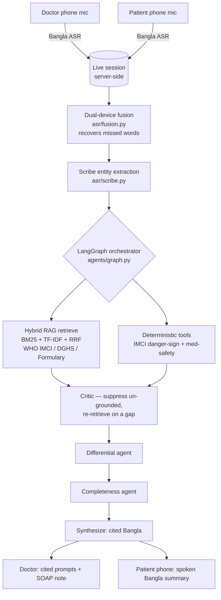

# Codoctor (কো-ডক্টর)
### An ambient Bangla clinical co-pilot + deterministic safety-net + patient-held record for Bangladesh's overloaded OPDs

> A second pair of ears in the consultation room. A patient scans a QR to join the doctor's live session; both phones listen in Bangla; the two transcripts are fused into one; a team of agents — grounded in official clinical guidelines, **with citations** — makes sure no danger sign or drug interaction is missed. The high-stakes calls are made by **deterministic rule engines, never the LLM**. The patient walks out with a plain-Bangla spoken summary they keep.

**Built for the SciBlitz AI Challenge 2026 — IEEE Student Branch, CUET · Track A (Health & Society).**

🔗 **Live (no login):** https://codoctor.vercel.app — open `/room` in **Chrome/Edge** and click **Run demo consultation**.
🔗 **API:** https://codoctor-api.onrender.com/docs

---

## The problem

In Bangladesh's government-hospital OPDs, one doctor often sees 80–150+ patients a day — a real consultation is **60–120 seconds**. In that window things get missed (an un-asked red-flag question, an unchecked drug interaction, an un-escalated danger sign); nothing is recorded (there is **no national EHR** — the record is a paper slip the patient loses); and the Bangla-only, low-literacy patient can't read the English prescription they're handed.

## The core idea: the LLM never decides — it only narrates

Every high-stakes call is made by a **deterministic, auditable rule engine**, and each returns its own citation:

- **`safety/imci.py`** — the WHO IMCI "cough or difficult breathing" decision tree (age-specific fast-breathing thresholds: ≥50/min at 2–11 months, ≥40/min at 12–59 months; plus chest indrawing, stridor, and general danger signs).
- **`safety/medsafety.py`** — allergy, class cross-sensitivity, drug–drug interaction, and duplication checks against exact-match tables.

The LLM (key-optional; defaults to a deterministic Bangla template) only **rephrases already-grounded findings** in plain Bangla, and a critic step suppresses anything not backed by a retrieved guideline chunk. This is the cleanest answer to the obvious objection — *"what if the AI is wrong?"* — the dangerous decisions are not the AI's to make.

## What it does, end to end

1. **QR-joined live session** — the doctor opens `/room` and gets a QR + session code; the patient scans it to join on their phone.
2. **Dual-device capture + fusion** — both phones stream browser-recognized Bangla speech into one session; `asr/fusion.py` reconciles the two transcripts and **recovers words one mic missed from the other** (only merging genuine same-utterance overlaps).
3. **Structure + reason** — `asr/scribe.py` extracts clinical entities; a **LangGraph** orchestrator retrieves cited guidance, runs the deterministic safety tools, self-critiques (re-retrieving on a grounding gap), then runs differential + completeness agents and synthesizes.
4. **Two outputs** — the doctor gets cited prompts + an auto-drafted SOAP note; the patient's phone shows and **speaks** a plain-Bangla "what you have / do / watch for" summary.

**Advisory & non-diagnostic. The clinician is always the decision-maker.**

## Architecture



## Results (reproducible)

Software-correctness on our authored eval set — **not** patient-outcome accuracy. Run it yourself:

```bash
cd backend && python eval/run_eval.py
```

| Metric | Result |
|---|---|
| IMCI classification accuracy (N=17) | **17/17 (100%)** |
| Danger-sign recall — missed referrals | **5/5 — 0 missed** |
| Specificity — false referrals | **12/12 — 0 false** |
| Medication-safety catch rate (N=13) | **7/7 (100%)** |
| Medication false-positives | **0/6 (0%)** |
| Orchestrator grounding / citation | **3/3 (100%)** |
| Honest refusal on insufficient data | **1/1 (100%)** |

Unit tests: **27/27** (`safety` 9 · `rag` 6 · `asr` 4 · `agents` 4 · `sessions` 4) — `python backend/tests/test_*.py`.

## Routes

| Route | What it is |
|---|---|
| `/` | Landing — problem, how it works, the agents, safety stance |
| `/room` | **Real live consultation** — create a session, show the QR, both phones listen, fuse → analyze → push to patient. **`Run demo consultation`** replays the canonical case through the full pipeline with no second phone. |
| `/patient?s=<id>` | **Real patient phone** — joins a session, listens, then shows + speaks the actual Bangla summary. `/patient` with no id is the scripted demo. |
| `/doctor` | Scripted demo cockpit (iOS-safe; no mic needed) — live transcript → agent trace → the two deterministic catches → SOAP note |
| `/live` | Voice quick-check — speak/type a child's symptoms, get a grounded cited assessment from the live backend |

## Tech stack (as built)

| Layer | Choice |
|---|---|
| Frontend | Next.js 14 + Tailwind on Vercel |
| Backend | Python FastAPI on Render |
| Agents | LangGraph orchestrator (intake → retrieve → tools → critic → differential → completeness → synthesize) |
| Retrieval | **Dependency-free hybrid: BM25 + TF-IDF cosine + Reciprocal Rank Fusion** over a curated, cited WHO IMCI / DGHS STG / National Formulary corpus |
| ASR / TTS | **Browser Web Speech API** (`bn-BD`) — keyless; with a typed/seeded fallback |
| LLM | Key-optional Bangla **narration only** — never the high-stakes decision; deterministic template by default |
| Safety core | Deterministic WHO IMCI danger-sign tree + drug allergy/interaction/duplication engine |
| Live sync | Short HTTP polling (~3s) between the two devices' views |

## Run it locally

**Backend** (Python 3.11+):
```bash
cd backend
python -m venv .venv && source .venv/Scripts/activate   # Windows; use bin/activate on macOS/Linux
pip install -r requirements.txt
uvicorn app.main:app --reload --port 8000               # docs at http://localhost:8000/docs
```

**Frontend** (Node 18+):
```bash
cd frontend
npm install
echo "NEXT_PUBLIC_API_URL=http://localhost:8000" > .env.local
npm run dev                                              # http://localhost:3000
```

Open `http://localhost:3000/room` in Chrome → **Run demo consultation**, or scan the QR with a phone to join a live two-device session.

> Notes: mic + Bangla speech recognition need **Chrome/Edge** (not iOS Safari). The hosted backend is on Render's free tier and **sleeps after ~15 min idle** — the first request may take ~30–60s to wake.

## Roadmap (architected, not yet built)

WebSocket real-time (today: HTTP polling) · speaker diarization (today: time + lexical-overlap fusion) · dense retriever / BGE-M3 (the `retriever.search()` contract is the swap-in point) · durable longitudinal multi-visit record (today: in-memory session + on-device summary) · fine-tuned Bangla medical ASR · corpus beyond pediatric ARI · clinician co-sign at scale.

## Docs

- **[PRD.md](PRD.md)** — full product spec, data contracts, RAG design, rubric mapping
- **[docs/REPORT.md](docs/REPORT.md)** — project report · **[docs/MODEL_CARD.md](docs/MODEL_CARD.md)** — model & data card · **[docs/DEMO_SCRIPT.md](docs/DEMO_SCRIPT.md)** — demo storyboard · **[docs/WINNING_STRATEGY.md](docs/WINNING_STRATEGY.md)** — competition strategy

## License & disclaimer

Codoctor is a clinical **decision-support** tool. It does not diagnose, prescribe, or replace a licensed clinician. All outputs are advisory and must be confirmed by a qualified doctor. See the [Model & Data Card](docs/MODEL_CARD.md) for datasets, models, licenses, and known limitations.
